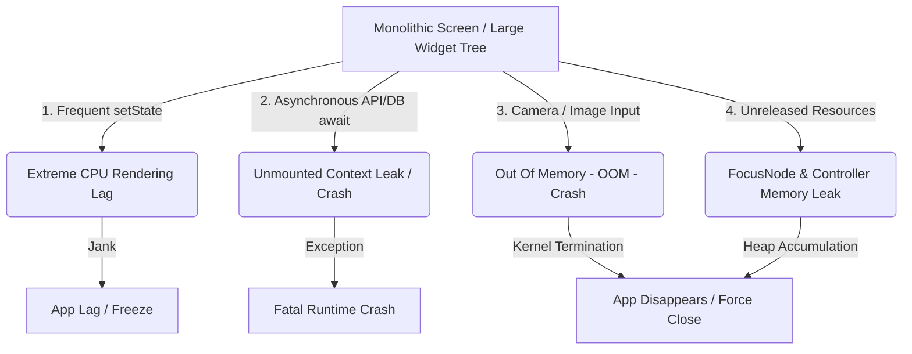

# Architectural Refactoring & Clean Directory Plan
## RetailDost (OruShops) Monolithic De-coupling & Crash Prevention Blueprint

This plan outlines a highly scalable, robust refactoring strategy to break down the monolithic files in `lib/presentation/screens` into modular, high-performance, and crash-resilient features. By implementing this plan, RetailDost will achieve buttery-smooth 120 FPS rendering, zero Out-Of-Memory (OOM) image crashes, and absolute protection against async context leaks.

---

## 1. Monolithic Hotspots & Crash Drivers

Our analysis shows that several files are massive hubs containing UI layout, local state, hardware interfaces, validation logic, database queries, and keyboard event handling.

### The Monolithic Offenders:
*   **`products_screen.dart` (127 KB, ~2,500+ lines)**: Handles product browsing, searching, real-time filtering, catalog layout toggle, custom sorting, and multi-select bulk operations.
*   **`create_product_screen.dart` (68 KB, 1,690+ lines)**: A 5-step stepper wizard capturing categories, barcodes, wholesale costs, expiry dates, serial/IMEI validation, staff commissions, and dynamic variant matrixes.
*   **`edit_product_screen.dart` (62 KB, ~1,500 lines)**: Re-implements similar heavy forms as the create screen with secondary edit validation, data hydration states, and deletion warning flows.
*   **`inventory_screen.dart` (53 KB, ~1,200 lines)**: Stock adjustment hub, barcode scanners, CSV export logic, and fast increment/decrement interactions.

---

## 2. Root Causes of High Crash Risk & Jank



### A. Context Leaks across Asynchronous Boundaries
*   **The Issue**: Screens await long-running network/DB requests (e.g., `await productCrudService.saveProduct()`) and immediately proceed with `Navigator.pop(context)` or `ScaffoldMessenger.of(context).showSnackBar()` without verifying if the user has navigated away.
*   **The Result**: `StateError (LookUpWidget on unmounted context)` resulting in silent or loud application crashes.

### B. Memory Exhaustion (OOM) via Image Capture & Storage
*   **The Issue**: High-resolution camera images (`_productImage`) are held in memory directly as full-resolution raw files on the main heap thread without compression or aggressive garbage disposal.
*   **The Result**: Image preview rendering inside massive widget rebuild trees frequently exhausts available RAM on mid-to-low-tier retail devices, triggering immediate OS-level process termination.

### C. Extreme Main-Thread Rendering Lag (Jank)
*   **The Issue**: In `create_product_screen.dart` (and `products_screen.dart`), the entire 1,500-line widget tree is bound together. Typing inside a price, quantity, or variant field invokes a parent `setState()`, causing the **entire** multi-step stepper, list lists, suggestion grids, and navigation indicators to rebuild simultaneously.
*   **The Result**: Extreme keyboard typing delay, dropped frames (jank), UI lockup, and double-tap event collisions that crash the form state.

### D. FocusNode & Controller Resource Leaks
*   **The Issue**: When mixing 10+ dynamic fields (ISBN, serial number, IMEI, wholesale price, margin, quantity, category search, barcode text) in a single screen, disposing of their corresponding `TextEditingController`s and `FocusNode`s is easily missed or incorrectly handled during dynamic step transitions.
*   **The Result**: Accumulative memory leaks that degrade performance the longer the app remains open, eventually culminating in a crash.

---

## 3. The Scalable "Feature-First" Directory System

To ensure top-notch modularity, scalability, and code isolation, we will transition RetailDost from a loose hybrid structure to a strict, production-ready **Feature-First / Domain-Driven Design (DDD) Hybrid**.

### High-Level Architecture Overview:
```
lib/
├── core/                        # Global shared utilities, network client, base widgets
│   ├── theme/                   # AppTheme tokens, styles, gradients
│   ├── database/                # DatabaseHelper, migrations, schema constants
│   ├── services/                # Device-specific and platform service definitions
│   └── widgets/                 # Reusable atomic UI components (buttons, textfields, custom cards)
│
├── features/                    # Self-contained modules carrying distinct business domain
│   ├── inventory/               # The inventory domain containing product creation, listing, edit
│   │   ├── domain/              # Business Models & Domain Entities (clean of Flutter dependencies)
│   │   │   ├── product.dart
│   │   │   └── variant.dart
│   │   │
│   │   ├── data/                # Data sources, local db client, repository implementation
│   │   │   ├── repositories/    # InventoryRepositoryImpl
│   │   │   └── datasources/     # LocalInventoryDataSource
│   │   │
│   │   ├── controllers/         # State Management & Business Controllers (Riverpod / Notifiers)
│   │   │   ├── products_notifier.dart
│   │   │   └── product_form_notifier.dart
│   │   │
│   │   └── presentation/        # Feature-specific UI Layer (Screens & dedicated widgets)
│   │       ├── screens/
│   │       │   ├── products_dashboard_screen.dart
│   │       │   └── create_product_screen/   # Monolith broken down into modular steps
│   │       └── widgets/
│   │           ├── product_list_item.dart
│   │           ├── product_search_bar.dart
│   │           └── create_steps/
│   │               ├── category_step_view.dart
│   │               ├── price_step_view.dart
│   │               ├── stock_step_view.dart
│   │               └── variant_matrix_view.dart
```

### Why this is highly scalable:
1.  **Isolation**: Developers can work on `inventory` without touching `billing` or `auth` code.
2.  **Explicit Scopes**: State is bounded within `controllers/` so UI widgets are purely declarative views.
3.  **No Core Contamination**: Feature screens import global shared components exclusively from `core/widgets/` or `core/theme/`.

---

## 4. Step-by-Step Monolith Refactoring (Refraction) Blueprint

Here is the strategic plan to break down and bulletproof the massive screens.

### Phase 1: Hardening & Crash Prevention (Day 1-2)
Prioritize code-level adjustments that address fatal runtime exceptions.

*   **Action 1: Implement Async BuildContext Checkers**
    Wrap all async navigation, snackbars, and dialog completions in a robust mounting verification.
    ```dart
    // Before:
    await ref.read(productCrudServiceProvider).save(product);
    Navigator.pop(context); // CRITICAL CRASH RISK if screen was closed during save
    
    // After:
    await ref.read(productCrudServiceProvider).save(product);
    if (!context.mounted) return;
    Navigator.pop(context);
    ```
*   **Action 2: Isolate and Offload Heavy DB Queries**
    Database indexing, parsing massive JSON files (like `catalog_data.dart` which is **124KB**!), or loading 30,000+ records must be offloaded from the UI main-thread.
    ```dart
    // Implement Dart Isolates or utilize Flutter's compute function for search/indexing
    final searchResults = await compute(filterCatalogData, query);
    ```

---

### Phase 2: Decoupling State from UI Widgets (Day 3-4)
Extract heavy business logic out of the UI widgets and place it into clean, testable state containers.

*   **Action 3: Create a Dedicated Form State Model**
    Define a simple, immutable state class that holds the current values of the multi-step form.
    ```dart
    class ProductFormState {
      final int currentStep;
      final Category? selectedCategory;
      final String name;
      final double sellingPrice;
      final double buyingCost;
      final double stockQty;
      final File? compressedImage;
      final List<Variant> variants;
      final bool isService;
      final bool isLoose;
      // Constructor, copyWith, etc.
    }
    ```
*   **Action 4: Implement a Notifier for Form Control**
    Write a `ProductFormNotifier` (using Riverpod or block/cubit pattern) that coordinates validation, category changes, stock increments, and image saving. This leaves the `create_product_screen.dart` free of complex math, local boolean switches, and custom step rules!

---

### Phase 3: Stepper Widget Decomposition (Day 5-6)
Divide the massive screens into a cohesive folder of small step files.

*   **Action 5: Extract Stepper Steps into Sub-Widgets**
    Convert the giant `_buildStepCategory()`, `_buildStepInfo()`, `_buildStepPrice()`, and `_buildStepStock()` functions into standalone, decoupled `StatelessWidgets` inside a subfolder:
    *   `presentation/screens/create_product_screen/steps/category_step.dart`
    *   `presentation/screens/create_product_screen/steps/info_step.dart`
    *   `presentation/screens/create_product_screen/steps/pricing_step.dart`
    *   `presentation/screens/create_product_screen/steps/stock_step.dart`
    *   `presentation/screens/create_product_screen/steps/variant_matrix_step.dart`
*   **Action 6: Reassemble the Orchestrator**
    The main `CreateProductScreen` becomes a simple, lightweight layout wrapper (~150 lines) that switches steps and manages global submission buttons.
    ```dart
    Widget build(BuildContext context, WidgetRef ref) {
      final step = ref.watch(productFormNotifierProvider.select((s) => s.currentStep));
      return Scaffold(
        appBar: AppBar(title: Text('Add Item')),
        body: IndexedStack(
          index: step,
          children: const [
            CategoryStepView(),
            InfoStepView(),
            PricingStepView(),
            StockStepView(),
            VariantMatrixStepView(),
          ],
        ),
      );
    }
    ```

---

## 5. Optimal Performance & Memory Tuning

To guarantee a premium, buttery-smooth POS experience on all low-tier retail terminals, apply the following optimization techniques:

### I. Render Rebuild Minimization
*   **Debounced Input Listeners**: When suggestions are populated as the user types (e.g., searching `catalog_data.dart` for product matches), attach a **250ms debounce** to the name controller. This prevents querying database catalogs on every single keystroke.
*   **Const Constructors**: Ensure all step screens, custom cards, lists, icon groupings, and divider blocks utilize `const` widgets, allowing Flutter to completely bypass unnecessary redraw trees.

### II. Advanced Memory & Image Optimization
*   **Compacting Image Resolution**: Raw camera photos are often 5MB-10MB in resolution. Implement an automated compression utility immediately on capture before storing the file in state.
    ```dart
    import 'package:flutter_image_compress/flutter_image_compress.dart';
    
    Future<File> compressProductImage(File rawFile) async {
      final targetPath = '${rawFile.parent.path}/compressed_${DateTime.now().millisecondsSinceEpoch}.jpg';
      final compressedFile = await FlutterImageCompress.compressAndGetFile(
        rawFile.absolute.path,
        targetPath,
        quality: 70, // 70% quality yields high visual clarity with up to 90% size reduction
        minWidth: 800,
        minHeight: 800,
      );
      return File(compressedFile!.path);
    }
    ```
*   **Dispose Guards**: Force-dispose all `TextEditingController`s and `FocusNode`s. Since sub-steps will now be standalone widgets, they will manage their local controllers through their own lifecycle, preventing garbage collection leaks.

### III. Scrolling Lists Virtualization
*   **In `products_screen.dart`**: Instead of generic lists or raw maps, use `ListView.builder` exclusively with `itemExtent` or `prototypeItem` configured. This allows Flutter to pre-calculate the scroll viewport dimensions, achieving dynamic memory pooling and zero scrolling stutter during rapid scrolls.

---

## Refactoring Execution Plan (Phased Checklist)

- [ ] **Phase 1: Setup Architecture & Hardening**
  - [ ] Create the new directory structures inside `lib/features/inventory`.
  - [ ] Implement `compressProductImage()` utility in `lib/core/utils/image_helper.dart`.
  - [ ] Add explicit context mounting checks (`if (!context.mounted) return;`) globally to all async database and permission blocks.
- [ ] **Phase 2: Extracting Products List Screen (`products_screen.dart`)**
  - [ ] Move searching and filtering calculations off the main UI thread using isolates/compute helpers.
  - [ ] Isolate individual list widgets (e.g., product item card, empty search states) to separate files.
  - [ ] Convert manual loops into an optimized, extent-bound `ListView.builder`.
- [ ] **Phase 3: Restructuring Product Creation (`create_product_screen.dart`)**
  - [ ] Establish `ProductFormState` and the state notifier.
  - [ ] Deconstruct step screens into the dedicated `steps/` folder.
  - [ ] Integrate debounced suggestion retrieval for item names.
- [ ] **Phase 4: Alignment & Cleanup**
  - [ ] Move `edit_product_screen.dart` to share the newly decoupled state structures.
  - [ ] Delete legacy unreferenced files, clean up barrel files, and perform full analyzer verification.
